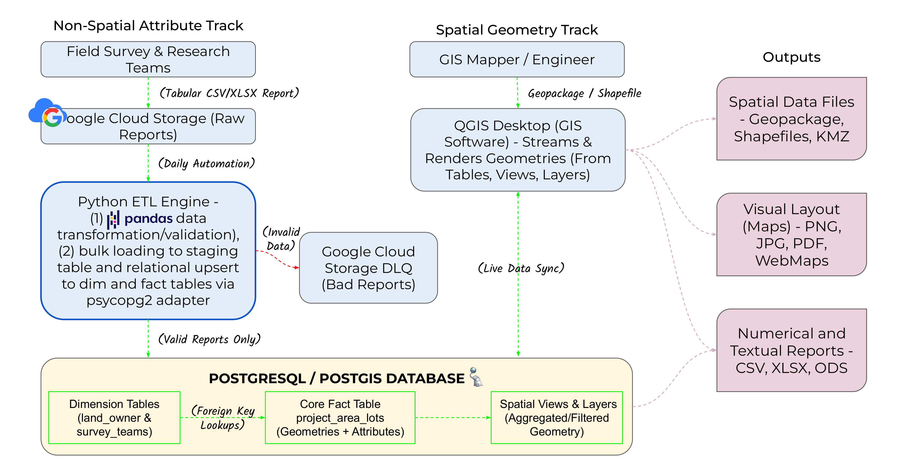
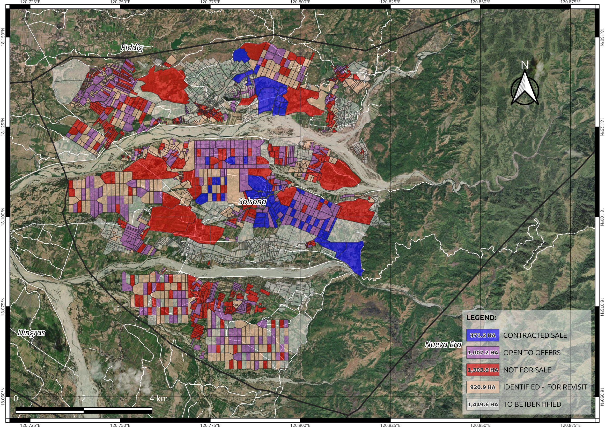
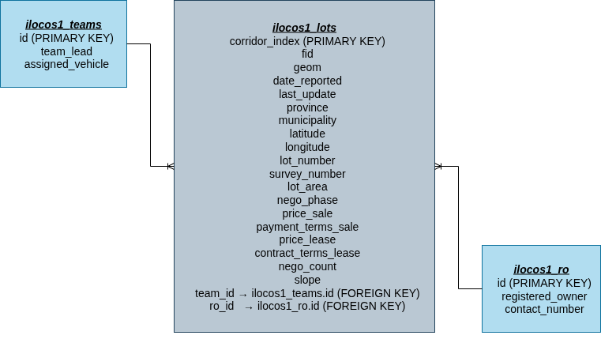

# Transforming Geospatial Data: An End-to-End PostGIS Pipeline for Land Asset Management

By Joseph Viernes

## Project Overview
This project transforms raw geospatial datasets (e.g., GeoPackage, Shapefiles) into a structured PostGIS database to support land parcel inventory and spatial analysis. It enables efficient storage, querying, and management of land asset data for real estate, site selection, and industrial applications such as solar power development.

By centralizing data within a spatially enabled PostgreSQL/PostGIS database, the system improves query performance, ensures data consistency, and eliminates repetitive data processing tasks such as rejoining attribute tables during updates.

Updates to spatial features (e.g., polygons) and attribute data can be managed interactively through GIS tools like QGIS or directly via SQL queries, providing a flexible, scalable, and integrated solution for maintaining land parcel datasets.

Furthermore, to keep operational data accurate, it features a Python-driven ETL pipeline that ingests tabular ground reports (CSV/XLSX) from field survey teams. This pipeline automatically enriches and updates the non-spatial attributes—such as land title no., ownership information, and negotiation statuses—tied directly to existing spatial layers, eliminating manual data entry and ensuring data consistency across applications like QGIS.

## ETL Architecture & Data Workflow

### Architectural Workflow Diagram

The system maintains a strict separation of concerns to ensure data integrity. Spatial geometries (the parcel/features shapes) are managed interactively by a GIS Engineer via a live desktop connection, while non-spatial operational attributes (owner data, lot details and negotiation updates) are automatically ingested and validated via a Python-driven ETL pipeline. The system bridges the gap between field operations and spatial analysis by handling geometry and attribute data through two distinct workflows:



### Non-Spatial Attribute ETL Pipeline

The Attribute Track runs on a programmatic ETL pipeline (`pandas` + `psycopg2`) designed to automate data validation, transformation, and ingestion without manual SQL execution.

#### 1. Extract & Idempotency Gate
* **Source & Capture:** The pipeline programmatically scans a designated Google Cloud Storage (GCS) bucket where field teams upload daily tabular ground reports (CSV/XLSX).
* **Idempotency Logic:** The script evaluates file timestamps to isolate **only the latest report** from the current day. This creates a strict idempotency gate, ensuring that the production database will not re-process stale data or create duplicate operational records if multiple field files are uploaded within the same reporting window.

#### 2. Transform & Quality Gate (DLQ)
* **Data Transformation & Validation:** The raw data is loaded into a pandas DataFrame where it passes through a structural quality gate. The script enforces schema compliance by verifying data types, standardizing date formats and mobile numbers, and cleaning names by removing honorifics or titles. Additionally, it handles overflow columns, and flags invalid negotiation tags.

* **Isolation (Dead Letter Queue):** Records that fail validation—such as those missing critical relational keys, lot identifiers, or lot owner details—are immediately isolated from the clean dataset. These invalid rows are exported as a standalone error log and routed back to an invalid_reports/ directory in GCS. This Dead Letter Queue (DLQ) keeps the ingestion pipeline running smoothly without halting operations, allowing field teams to fix faulty records independently.

#### 3. Load & Relational Upsert
* **Bulk Ingestion:** Validated, clean records are streamed efficiently via `psycopg2` into a volatile PostgreSQL staging table (`ground_reports_staging`).
* **Atomic Relational Upsert:** A specialized database transaction executes a multi-stage execution block:
  * **Dimension Sync:** It inserts or updates the Registered Owner (`ilocos1_ro`) and Team (`ilocos1_teams`) dimension tables first, handling unique database conflicts gracefully using `ON CONFLICT` constraints.
  * **Fact Enrichment:** It performs a set-based join between the staging table and the newly updated dimension tables to resolve dynamic foreign keys (`ro_id`, `team_id`). Finally, it upserts the clean operational attributes directly into the core spatial fact table (`ilocos1_lots`) using the unique `corridor_index`.
  * **Audit Logging:** Concurrently, the update is separately recorded in the `ground_reports_refined_records` table, maintaining an independent, high-fidelity ledger of all successfully processed updates for downstream tracking and analytics.

### Spatial Geometry Track (GIS Administration)
* **Actor:** GIS Engineer/Mapper
* **Tooling:** QGIS connection to PostGIS
* **Process:** Handles direct spatial data creation/modification and manual attribute updates.
* **Live Production Output & Dynamic Mapping:** The sample digital map below was generated in QGIS by directly streaming features from the PostGIS database. Driven by the live connection, parcel polygons are dynamically color-coded based on real-time negotiation phases (nego_phase) updated by the Python ETL pipeline. Any map canvas refresh instantly reflects the latest field metrics (e.g., shifting from OPEN TO SALE OR LEASE to CONTRACTED SALE/LEASE), completely eliminating manual layer joins or shapefile exports.



> 💡 **Dynamic Data Mapping/Live QGIS Refresh::** Because QGIS maintains a direct, live connection to the PostgreSQL instance, a map canvas refresh instantly reflects the latest field metrics (such as a shift from *OPEN TO SALE OR LEASE* to *CONTRACTED SALE/LEASE*) without requiring manual layer joins or shapefile exports.

## PostGIS Data Infrastructure: Initial Migration & Dimensional Modeling

This section outlines the PostGIS database initialization and relational schema design. Baseline spatial layers are seeded and structured into a dimensional model first, establishing the target core infrastructure that the Python ETL pipeline dynamically resolves and updates.

### Data Description
The dataset used in this project is a fictional and anonymized representation of land parcels in Ilocos Region, Philippines. It is intended solely for demonstration and development purposes.

All spatial features and attribute data have been modified to remove any real-world references, ensuring that no sensitive or identifiable information is included.

### Migration-Phase Data Transformation

[Link to full schema.sql](/database/schema.sql)

The transformation layer focuses on cleaning, standardizing, and enriching the raw staging table (ilocos1_row_lots) to prepare it for migration to main table.

Key steps include schema adjustments, removal of irrelevant attributes, fixing inconsistent column names, and generating surrogate keys for relational mapping.

```sql
-- Add new operational and relational columns
ALTER TABLE ilocos1_row_lots ADD COLUMN team_lead VARCHAR(30);
ALTER TABLE ilocos1_row_lots ADD COLUMN assigned_vehicle VARCHAR(20);
ALTER TABLE ilocos1_row_lots ADD COLUMN ro_id SMALLINT;
ALTER TABLE ilocos1_row_lots ADD COLUMN team_id SMALLINT;

-- Remove unnecessary route columns
ALTER TABLE ilocos1_row_lots 
DROP COLUMN "ROUTE 1",
DROP COLUMN "ROUTE 2",
DROP COLUMN "ROUTE 3",
DROP COLUMN "ROUTE 4",
DROP COLUMN "ROUTE 5";

-- Fix inconsistent naming
ALTER TABLE ilocos1_row_lots
RENAME COLUMN "REGISTERED OWNER2" TO registered_owner;
```

A surrogate key (ro_id) is generated using a window function to uniquely identify registered owners.

```sql
UPDATE ilocos1_row_lots i
SET ro_id = r.rk
FROM (
    SELECT "CORRIDOR INDEX",
           DENSE_RANK() OVER (ORDER BY registered_owner DESC) AS rk
    FROM ilocos1_row_lots
) r
WHERE i."CORRIDOR INDEX" = r."CORRIDOR INDEX";
```

### Data Modelling

[Link to full schema.sql](/database/schema.sql)

The cleaned dataset is transformed into a relational schema following a fact–dimension structure. This improves query efficiency, reduces redundancy, and supports analytical use cases.

#### Fact Table

The ilocos1_lots table serves as the central fact table containing spatial, transactional, and descriptive attributes.

```sql
CREATE TABLE ilocos1_lots AS
SELECT
    fid,
    geom,
    "CORRIDOR INDEX" AS corridor_index,
    "REPORTED" AS date_reported,
    "LAST UPDATE" AS last_update,
    "PROVINCE" AS province,
    "MUNICIPALITY" AS municipality,
    "LATITUDE" AS latitude,
    "LONGITUDE" AS longitude,
    registered_owner,
    "LOT NUMBER" AS lot_number,
    "SURVEY NUMBER" AS survey_number,
    "LOT AREA (SQM)" AS lot_area,
    "NEGO PHASE" AS nego_phase,
    "PRICE (SALE)" AS price_sale,
    "PAYMENT TERMS (SALE)" AS payment_terms_sale,
    "PRICE (LEASE)" AS price_lease,
    "CONTRACT TERMS (LEASE)" AS contract_terms_lease,
    "NEGO COUNT" AS nego_count,
    "SLOPE" AS slope,
    ro_id,
    team_id,
    "TITLE" AS title,
    "TAX DEC" AS tax_dec
FROM ilocos1_row_lots;
```

#### Dimension Tables

Separate dimension tables are created to normalize repeated entities and improve relational integrity.

```sql
-- Registered Owner dimension
CREATE TABLE ilocos1_ro AS
SELECT DISTINCT
    ro_id,
    registered_owner,
    "MOBILE NO" AS contact_number
FROM ilocos1_row_lots;

-- Team dimension
CREATE TABLE ilocos1_teams AS
SELECT DISTINCT
    team_id,
    team_lead,
    assigned_vehicle
FROM ilocos1_row_lots;
```

#### Relationships & Constraints



Primary and foreign keys enforce relational integrity between fact and dimension tables.

```sql
-- Primary keys
ALTER TABLE ilocos1_lots ADD PRIMARY KEY (corridor_index);
ALTER TABLE ilocos1_ro ADD PRIMARY KEY (id);
ALTER TABLE ilocos1_teams ADD PRIMARY KEY (id);

-- Foreign keys
ALTER TABLE ilocos1_lots
ADD CONSTRAINT fk_ro
FOREIGN KEY (ro_id) REFERENCES ilocos1_ro(id);

ALTER TABLE ilocos1_lots
ADD CONSTRAINT fk_team
FOREIGN KEY (team_id) REFERENCES ilocos1_teams(id);
```

### Data Integrity & Automation

Constraints and identity columns ensure uniqueness and automated ID generation.

```sql
-- Prevent duplicate owners
ALTER TABLE ilocos1_ro
ADD CONSTRAINT unique_owner_contact UNIQUE (registered_owner);

-- Auto-generate IDs
ALTER TABLE ilocos1_ro ALTER COLUMN id ADD GENERATED ALWAYS AS IDENTITY;
ALTER TABLE ilocos1_teams ALTER COLUMN id ADD GENERATED ALWAYS AS IDENTITY;
ALTER TABLE ilocos1_lots ALTER COLUMN corridor_index ADD GENERATED ALWAYS AS IDENTITY;
```

## Future Improvements

* **Event-Driven DLQ Alerts:** Implement cloud-native event triggers (such as Google Cloud Functions or Slack Webhooks) to instantly alert field supervisors the moment an incoming report fails validation and lands in the DLQ.

* **Database Partitioning for Scale:** Implement PostgreSQL table partitioning based on geographic boundaries (e.g., partitioning the central fact table by province or municipality) to maintain sub-second query performance as the land inventory scales nationally.

* **Web Mapping Application & Vector Tiles:** Serve the PostGIS tables and spatial views dynamically using a lightweight vector tile server (such as Martin or Tegola) to display live, interactive parcel maps on a lightweight web-based dashboard using Leaflet or MapLibre GL.

## Acknowledgements

- CS50 (Harvard University) – for foundational courses in Python and SQL  
- edX – for hosting the CS50 learning platform